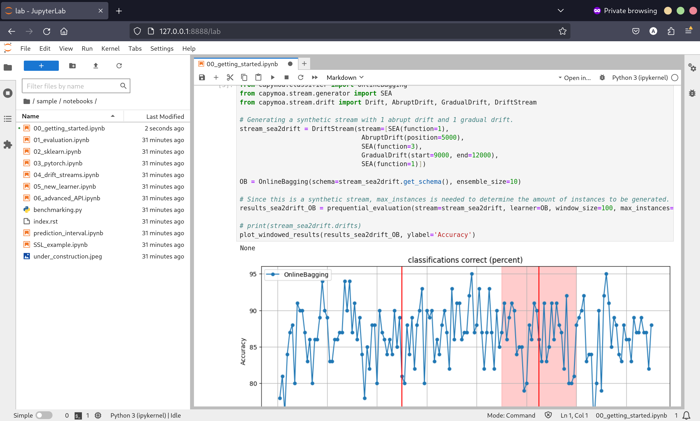

# Docker

CapyMOA provides a Docker image application containing a ready-to-go Jupyter
notebook. If you require a reproducible environment or want to experiment with
CapyMOA and have experience with Docker, this is the best place to begin.

Before you begin, you must have Docker installed. You can download and install
Docker from the [official website](https://docs.docker.com/get-docker/).




## Example

```bash
mkdir data work
docker run \
    -p 8888:8888 \
    -v ./work:/home/jovyan/work \
    -v ./data:/home/jovyan/data \
    tachyonic/jupyter-capymoa
```

With the container running, you can access the jupyter notebook interface by
visiting `http://<hostname>:8888/?token=<token>` in a browser, where:

* The hostname is the name of the computer running Docker. Usually, this is
    `localhost`.
* The token is the secret token printed in the console.

Once you have accessed the jupyter notebook interface, you can can play with the sample datasets and notebooks provided in `sample/notebooks` directory.

### Notes

* [`-p, --port`](https://docs.docker.com/engine/reference/run/#exposed-ports) maps
    port 8888 in the container to port 10000 on the host machine. If you do change
    the port on the host machine, make sure to change the port in the URL above.
* [`-v`](https://docs.docker.com/storage/bind-mounts/) flag lets the container
    access the `./work` and `./data` directories on the host machine as 
    `/home/jovyan/work` and `/home/jovyan/data` in the container, respectively.
    You can change the host directories to any directory on your machine.


## Directory Structure

* `/home/jovyan`: The home directory for the default user in the container.
    * `sample`: Contains sample datasets and notebooks.
        * `data`: Contains sample datasets.
        * `notebooks`: Contains sample notebooks.
    * `work`: An empty directory where you can mount your work.
    * `data`: The default directory where datasets will be downloaded to. You
        can mount a directory to this location to access datasets from your host
        machine and avoid downloading them multiple times.

## Environment Variables

See the [Environment Variables](https://capymoa.org/api/env.html#module-capymoa.env)
section for a list of environment variables that can be set to configure the tool.
You can set these environment variables using the [`-e, --env`](https://docs.docker.com/reference/cli/docker/container/run/#env) flag when running the Docker. For example,
to change the JVM arguments `CAPYMOA_JVM_ARGS`

```bash
docker run -p 8888:8888 -e CAPYMOA_JVM_ARGS="-Xmx4g" jupyter-capymoa
```


## Docker Compose Example

You can also use [Docker Compose](https://docs.docker.com/compose/) to remove the need to remember the command line arguments. Create a `docker-compose.yml` file with the following contents:

```yaml
services:
  jupyter-capymoa:
    image: tachyonic/jupyter-capymoa
    ports:
        - "8888:8888"
    volumes:
        - ./work:/home/jovyan/work
        - ./data:/home/jovyan/data
```

Then run the following command:

```bash
docker-compose up
```

Just like the earlier example you can access the jupyter notebook interface by visiting `http://<hostname>:8888/?token=<token>` in a browser.
